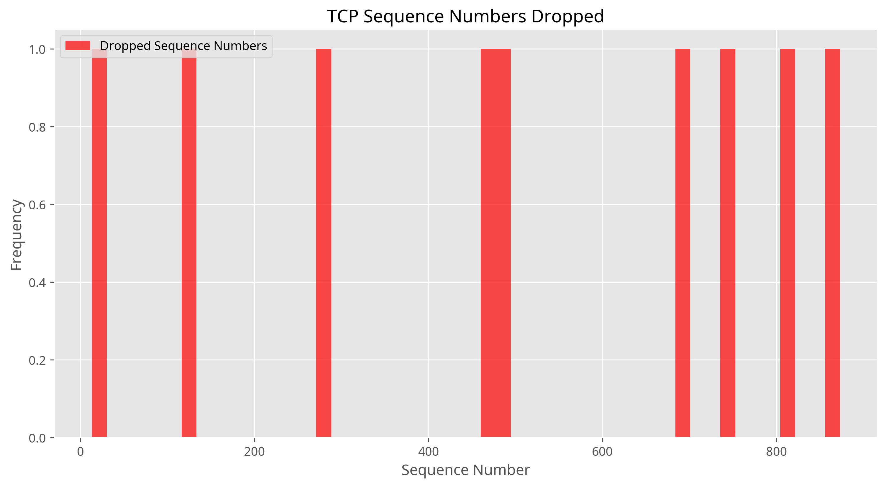

# TCP Sliding Window Protocol Implementation

[](https://opensource.org/licenses/MIT)
[](https://www.python.org/downloads/)

**Author:** Xiangyi Li (xiangyi@benchflow.ai)

## 📋 Project Overview

This project implements a TCP sliding window protocol with a client-server architecture for CS 258. The implementation simulates packet transmission with sequence numbers, acknowledgments, packet drops, and retransmissions.

### Key Features

- **Server-side implementation** that listens for connections, tracks missing packets, and calculates goodput
- **Client-side implementation** with sliding window management and packet retransmission
- **Visualization tools** for analyzing protocol performance
- **Comprehensive testing framework** for protocol verification

## 🚀 Getting Started

### Prerequisites

- Python 3.6 or higher
- Required Python packages: `matplotlib`, `numpy`, `pandas`

### Installation

1. Clone the repository:
   ```bash
   git clone https://github.com/kookiemaster/tcp_sliding_window_project.git
   cd tcp_sliding_window_project
   ```

2. Install required packages:
   ```bash
   pip install matplotlib numpy pandas
   ```

### Running the Application

1. Start the server:
   ```bash
   python server.py
   ```

2. In a separate terminal, start the client:
   ```bash
   python client.py
   ```

For testing with reduced packet count:
```bash
python test.py --packets 1000 --timeout 120
```

## 📊 Visualizations

The project includes several visualizations to analyze the performance of the TCP sliding window protocol:

### TCP Window Size Over Time


This graph shows how the sender's window size changes over time, demonstrating the congestion control mechanism.

### TCP Sequence Numbers Received


This visualization shows the sequence numbers received by the server over time, with a linear progression indicating steady packet reception.

### TCP Sequence Numbers Dropped



This histogram shows the distribution of dropped sequence numbers, aligning with the 1% random drop probability.

### Goodput Analysis


The goodput graph shows the ratio of received packets to sent packets over time, with an average of 0.9674.

### Retransmission Statistics

| # of retransmissions | # of packets |
|----------------------|--------------|
| 1                    | 9            |
| 2                    | 7            |
| 3                    | 4            |
| 4                    | 3            |

## 📝 Implementation Details

### Server Implementation

The server implementation includes:
- Passive listening for client connections
- Receiving sequence numbers from the client
- Tracking missing sequence numbers
- Sending ACK numbers back to the client
- Calculating and reporting goodput statistics

### Client Implementation

The client implementation includes:
- Connecting to the TCP server
- Sending sequence numbers using sliding window protocol
- Probabilistically dropping 1% of packets
- Retransmitting dropped packets after a specific time
- Adjusting sliding window based on received ACKs

## 📈 Performance Analysis

Despite the 1% packet drop rate, the protocol maintains a high goodput (96.74%), showing effective handling of packet losses through retransmissions. The window size adaptation demonstrates the congestion control aspect of the protocol, and most dropped packets were successfully delivered after 1-2 retransmissions.

## 📁 Project Structure

```
tcp_sliding_window_project/
├── server.py              # Server-side implementation
├── client.py              # Client-side implementation
├── visualizer.py          # Visualization module
├── test.py                # Test framework
├── test_simplified.py     # Simplified test with mock data
├── documentation.md       # Detailed project documentation
├── output/                # Output directory for visualizations
└── README.md              # Project overview and instructions
```

## 🔍 Future Improvements

1. **Dynamic Retransmission Timeout**: Implement an adaptive timeout mechanism based on round-trip time measurements
2. **Selective Acknowledgment**: Implement SACK to acknowledge non-contiguous blocks of data
3. **Advanced Congestion Control**: Implement more sophisticated algorithms like TCP Reno or TCP CUBIC
4. **Performance Optimization**: Optimize for handling larger numbers of packets and higher transmission rates
5. **Real Network Testing**: Test over real network conditions with varying latency and packet loss

## 📄 License

This project is licensed under the MIT License - see the LICENSE file for details.
